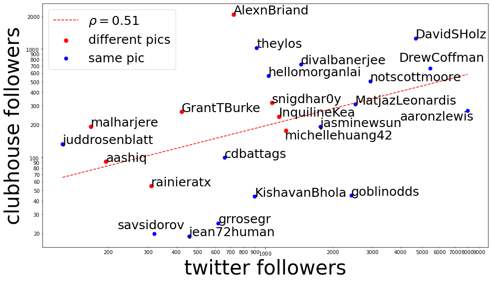

In this super scientific study we show that having massive amounts of twitter follower clearly implies tons of clubhouse fame.

Also, there seems to be two kinds of profiles with lots of clubhouse followers. Either they already have a large twitter following and the clubhouse follows, or they go by a different strategy: they change their profile picture on clubhouse!! If you look at the red datapoints, they get massively more (# clubhouse followers)/(# twitter follower) ratio because of this simple trick.

## What you need

### Data

Just create a kaggle account then download that juicy clubhouse [data](https://www.kaggle.com/johntukey/clubhouse-dataset) here, and make sure to call it `Clubhouse_Dataset_v1.db` at the root of the repo (after unzipping).

If you have never used python before:
```bash
pip install numpy sqlite3 pandas requests scipy matplotlib
jupyter notebook
```

Then click on the `tw_ch.ipynb` file and do Kernel > "Restart and run all cells"

### Optional

You might want to get a twitter account with credentials etc. for the v1... only if you want to try with your own followers, otherwise feel free to use data from my followers.
